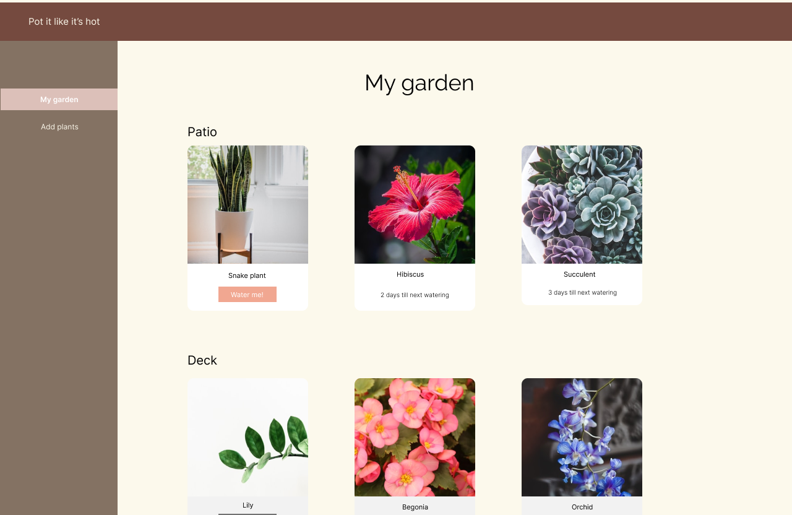

# Pot It Like It's Hot

## Description
This application allows users to cultivate their own garden by picking and watering plants. Our inspiration for taking care of plants was by the tamagotchi toys which were fed regularly.  Given a specific time parameter, the user will water specific plants when needed. This project was our first MVC full stack web app. We used passport JS to enable session usage. 

## Deployed URL
URL to deployed application: https://pilih.herokuapp.com/

## Table of Contents

- [Installation](#installation)
- [Usage](#usage)
- [Credits](#credits)
- [Technologies](#technologies)
- [License](#license)

## Installation

This is a browser based application. No extra installation steps are required to run this application. To run the application, open it in your browser.

## Usage

To use the application, refer to the deployed Heroku link. 

The user will be prompted to login.

The user will then be able to select a specific plant to add to their garden.

Once a plant has been selected, the user can then view their garden and water their plant. Each plant will show the time until the next watering and in which location the plant can be found in. Once a plant has been watered, then the water count will be reset.

If the user selects a specific plant, they will be redirected to the specific plant.

## Credits

Collaborators: 
stbuiemory Github: https://github.com/stbuiemory

Brandonk1023 Github: https://github.com/Brandonk1023

ClarenceAtBiteline Github: https://github.com/ClarenceAtBiteline

lillianlaihughes Github: https://github.com/lillianlaihughes

## Technologies

- Passport.js: https://www.passportjs.org/docs/
- Plantera API: https://perenual.com/docs/api
- Heroku
- MySQL
- Sequelize
- Handlebars JS
- Node JS
- Express JS
- Vanilla JS
- HTML, CSS

## License

This project is covered by an MIT License

